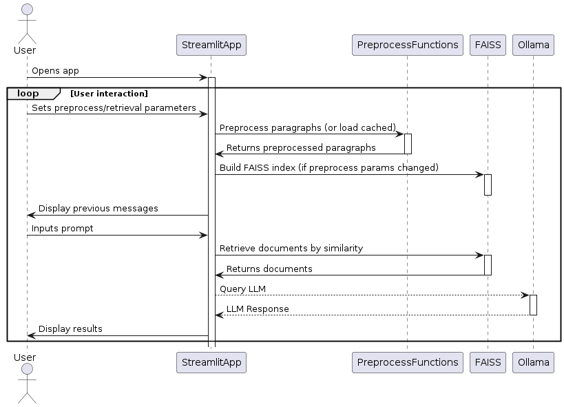

# Data Science Article Retrieval Report

## Contents:
1. [Introduction](#1-introduction)
2. [System design](#2-system-design)
3. [Technologies used](#3-technologies-used)
4. [Challenges encountered and solutions](#4-challenges-encountered-and-solutions)
5. [Areas for future improvements](#5-areas-for-future-improvements)

## 1. Introduction

The task lies in retrieving relevant articles excerpts from the **1300+ Towards DataScience Medium Articles Dataset** dataset ([link](https://www.kaggle.com/datasets/meruvulikith/1300-towards-datascience-medium-articles-dataset)).

Because pure article segment retrieval is quite a strange task for this dataset. This is due TDS articles necessarily being text written with a single idea thread from start to finish. This is why the "generation" part of RAG comes into play - LLM summarization of the retrieved documents can distill the core information. This is why this LLM summarization was added as an optional feature.

# 2. System design

### Overview

### Chunking strategy
1. Each article is divided into paragraphs (split by `"\n\n"`).
2. Consecutive 'code' lines are collapsed into a single paragraph (see [Code block problem](#code-blocks-in-articles))
3. Perform "semantic chunking" on the paragraphs:
    - Calculate embeddings for each paragraph using `EMBEDDING_MODEL`
    - Compute embedding similarity between each pair of consecutive paragraphs; compute $\mu$ and $\sigma$ of all these similarities
    - For each pair of consecutive paragraphs $A$ and $B$, collapse them together if $[sim(A,B) > \mu + \sigma * \text{stdMultiplier}]$

`EMBEDDING_MODEL="all-MiniLM-L6-v2"` was used for embeddings throughout the whole system - for chunking and for index creation

### LLM Generation
For generation from retrieved article segments, the LLaMA 2 was used through the Ollama framework due to it's simplicity of use. The *llama2* model was chosen because of its very good capabilities and its availability for free use.

## 3. Technologies used
- **Data preprocessing**
    - `pandas`, `numpy` - don't require much explanation
    - `sentence_transformers` (from HuggingFace, through LangChain)
- **Indexing**
    - `FAISS` (through LangChain) - chosen for its optimization for memory usage and speed (since the app is run locally)
- **LLM**
    - `ollama` app and corresponding python framework 
- **Front-end app** 
    - `streamlit` - chosen for its simplicity while providing enough functionality for the given task

## 4. Challenges encountered and solutions

### Code blocks in articles
Paragraphs in an article were separated using 2 newlines (`"\n\n"`).

Unfortunately, the text content of the articles in the dataset was just raw text (without any denotations of code blocks/outputs of code blocks) -  therefore, each code line was considered a new 'paragraph'.

This poses a challenge since we want to consider at least each continuous segment of code as a single chunk - this is because a single line of code most often doesn't contain much valuable semantic information.

**Solution:** *a heuristic approach was used to 'classify' whether a given line/paragraph is 'code' or not. This heuristic approach consisted of a set of Regular Expressions designed to detect Python code or lines without any latin letters.*

### Long preprocessing times
Joining article paragraphs requires calculating the embeddings for all of the paragraphs - which can be quite a lengthy even for small embedding models. This becomes especially pronounced when we allow the user to change the paragraph joining threshold dynamically.

**Solution:** *intermediate results, such as these paragraph embeddings with the relevant metadata, are cached by persisting them to disk*

### Coping with bad prompts/retrieval results
Because the user might enter a poor prompt (e.g. non-specific query "sklearn"), we might get poor retrieval results. And if we ask the LLM to just summarize the results, the output from the LLM might be not useful to the user at all.

**Solution:** *an additionnal instruction was added to the LLM 'system' prompt - asking the LLM to also provide the user with query revision advice if the retrival results are poor*

## 5. Areas for future improvements
- **Better code detection**. The regex patterns used are just a heuristic and work only for Python (will work poorly for other languages and command line commands). Ideally, we could train some classifier to determine whether a given strip of text is code or not. It could be a `NaiveBayes`, `SVM`, `LSTM` or any other suitable type of model.
- **Paragraph lookaround at query time**. Apart from chunking the paragraphs before indexing, we can also prepend/append neighboring paragraphs to the one retrieved from the FAISS index. The process could look like as follows:
    - Retrieve paragraph (with index `best_idx`) with highest similarity score to query
    - Calculate similarities of the query to paragraphs in the range `[best_idx-k : best_idx+k]`
    - Choose range of paragraphs with largest average (or any kind of weighted average) similarity to query
- **Query reformulation**. Preprocess the user's query using an LLM to reformulate the query in a way that adds more context to achieve better retrieval results (e.g. "XGBoost" query might be too small and lacking specific information). Additionally, the LLM might evaluate to which degree the topic of the query is relevant to Data Science and politely refuse to search if they query is too unrelated or is formulated in an offensive manner.
- **Limit length of context passed to LLM**. Introduce this safeguard to avoid errors or limit processing time. This can be done by truncating the whole LLM input, or truncating each retrieved result, or extracting most important subparagraph section.
- **Cache FAISS index to disk**
- **Remove `langchain` dependency**. Since LangChain is quite an unstable library with often confusing and rigid APIs, it is probably best to remove the reliance on it and use `sentence_transformers` and `faiss` libraries directly. That way the system will be more flexible to add more custom features 
